<!-- ═══════════════════════════ HEADER ═══════════════════════════ -->
<div align="center">


<a href="https://github.com/ashrithBalaji456/Venkatesh_portfolio">
  
</a>

<br/>

[](https://venkateshportfolio-chi.vercel.app)
[](https://github.com/ashrithBalaji456/Venkatesh_portfolio)


</div>

---

## 📑 Table of Contents

| # | Section | # | Section |
|:-:|---------|:-:|---------|
| 1 | [About](#-about) | 8 | [Data Charts](#-data-charts) |
| 2 | [Features](#-features) | 9 | [Installation](#-installation--setup) |
| 3 | [Tech Stack](#-tech-stack) | 10 | [Scripts](#-available-scripts) |
| 4 | [Architecture & Workflows](#-architecture--workflow-charts) | 11 | [Deployment](#-deployment) |
| 5 | [Project Structure](#-project-structure) | 12 | [Customization](#-customization-guide) |
| 6 | [Page Journey](#-user-journey) | 13 | [Roadmap](#-roadmap) |
| 7 | [Animation Pipeline](#-animation-pipeline) | 14 | [Contributing & Contact](#-contributing) |

---

## 🧑‍💻 About

A modern, **fully animated developer portfolio** built with **Next.js 14 (App Router)** and **React 18**. It combines smooth scrolling, scroll-triggered reveals, spring physics, and 3D-flavoured Tailwind utilities to present projects, skills, and contact details in a polished, responsive interface.

> 🔗 **Live site:** [venkateshportfolio-chi.vercel.app](https://venkateshportfolio-chi.vercel.app)

<div align="center">

```text
┌──────────────────────────────────────────────────────────┐
│   Design  ──►  Build  ──►  Animate  ──►  Ship on Vercel  │
└──────────────────────────────────────────────────────────┘
```

</div>

---

## ✨ Features

<div align="center">

| 🎨 Design | ⚡ Performance | 🎬 Motion | 📱 Responsive |
|:---------:|:-------------:|:---------:|:-------------:|
| Tailwind CSS utility styling | Next.js App Router | Framer Motion transitions | Mobile-first layout |
| Inter font via Fontsource | Optimised builds | GSAP timelines | Fluid typography & grids |
| Lucide icon set | Static + dynamic rendering | React Spring physics | Works on all screen sizes |
| 3D utilities (`tailwindcss-3d`) | Vercel edge delivery | Lenis smooth scroll | Touch-friendly interactions |

</div>

- 🌀 **Smooth scrolling** powered by Lenis
- 👀 **Scroll-triggered reveal animations** via `react-intersection-observer`
- 🧲 **Spring-based micro-interactions** via `@react-spring/web`
- 🎞️ **Timeline animations** via GSAP
- 🧩 **Reusable component architecture** in `/components`
- 🚀 **One-click deploy** to Vercel

---

## 🛠 Tech Stack

<div align="center">


</div>

| Layer | Technology | Version | Purpose |
|-------|-----------|:-------:|---------|
| **Framework** | Next.js | `14.2.35` | Routing, SSR/SSG, build tooling |
| **UI Library** | React / React DOM | `^18.3.1` | Component model |
| **Styling** | Tailwind CSS | `^3.3.0` | Utility-first CSS |
| **Styling** | tailwindcss-3d | `^1.1.0` | 3D transform utilities |
| **Styling** | PostCSS + Autoprefixer | `^8.4.38` / `^10.0.1` | CSS processing |
| **Animation** | Framer Motion | `^11.0.3` | Declarative animations & gestures |
| **Animation** | GSAP | `^3.12.5` | Timeline & scroll animation |
| **Animation** | @react-spring/web | `^9.7.3` | Physics-based motion |
| **Scroll** | Lenis | `^1.3.23` | Buttery smooth scrolling |
| **Utility** | react-intersection-observer | `^9.5.3` | Detect elements entering viewport |
| **Icons** | lucide-react | `^1.14.0` | SVG icon set |
| **Font** | @fontsource/inter | `^5.2.5` | Self-hosted Inter font |

---

## 🧭 Architecture & Workflow Charts

### 1️⃣ High-Level System Architecture

```mermaid
flowchart TB
    subgraph Client["🖥️ Browser / Client"]
        U([👤 Visitor])
        UI[React UI Components]
        ANIM[Animation Layer<br/>Framer Motion · GSAP · React Spring]
        SCROLL[Lenis Smooth Scroll]
    end

    subgraph App["⚙️ Next.js 14 App Router"]
        LAYOUT[app/layout.js<br/>Global layout and fonts]
        PAGE[app/page.js<br/>Home page]
        COMP[components/*<br/>Sections]
    end

    subgraph Style["🎨 Styling Pipeline"]
        TW[Tailwind CSS]
        PCSS[PostCSS + Autoprefixer]
        T3D[tailwindcss-3d]
    end

    subgraph Host["☁️ Hosting"]
        GH[(GitHub Repo)]
        VC[Vercel Build and CDN]
    end

    U --> UI
    UI --> ANIM
    UI --> SCROLL
    LAYOUT --> PAGE --> COMP
    COMP --> UI
    TW --> PCSS
    T3D --> TW
    PCSS --> App
    GH -- push to main --> VC
    VC -- serves --> U

    classDef client fill:#312e81,stroke:#a78bfa,color:#fff
    classDef app fill:#0f172a,stroke:#38bdf8,color:#fff
    classDef style fill:#064e3b,stroke:#34d399,color:#fff
    classDef host fill:#4c1d95,stroke:#f472b6,color:#fff
    class U,UI,ANIM,SCROLL client
    class LAYOUT,PAGE,COMP app
    class TW,PCSS,T3D style
    class GH,VC host
```

### 2️⃣ Development → Deployment Workflow

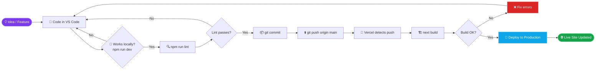

### 3️⃣ Request / Render Sequence

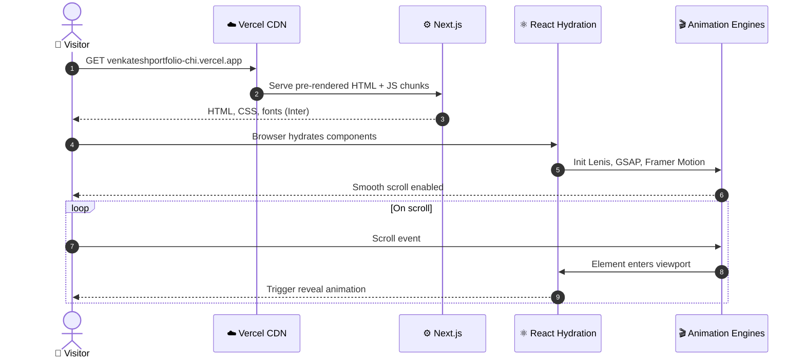

### 4️⃣ Git Branching Workflow

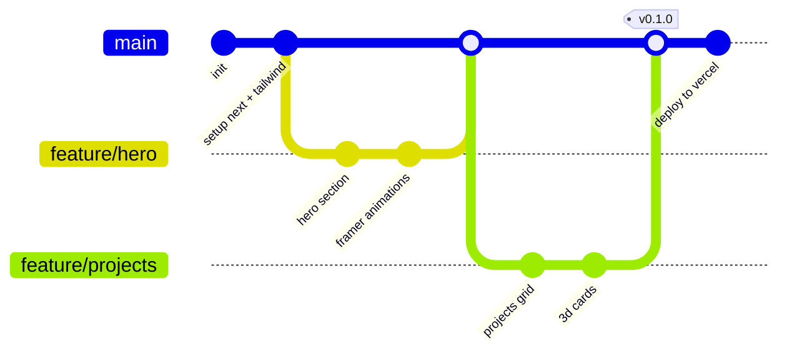

### 5️⃣ Component State Machine (Scroll Reveal)

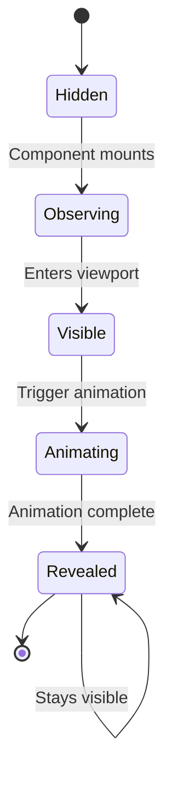

---

## 📂 Project Structure

```text
Venkatesh_portfolio/
├── 📁 app/                  # Next.js App Router (layout, pages, global styles)
├── 📁 components/           # Reusable UI sections & animated components
├── 📁 public/               # Static assets (images, icons, favicon, resume)
├── 📄 .gitignore            # Ignored files
├── 📄 jsconfig.json         # Path aliases (e.g. @/components)
├── 📄 package.json          # Dependencies & scripts
├── 📄 package-lock.json     # Locked dependency tree
├── 📄 postcss.config.js     # PostCSS plugins
└── 📄 tailwind.config.js    # Tailwind theme & plugins
```

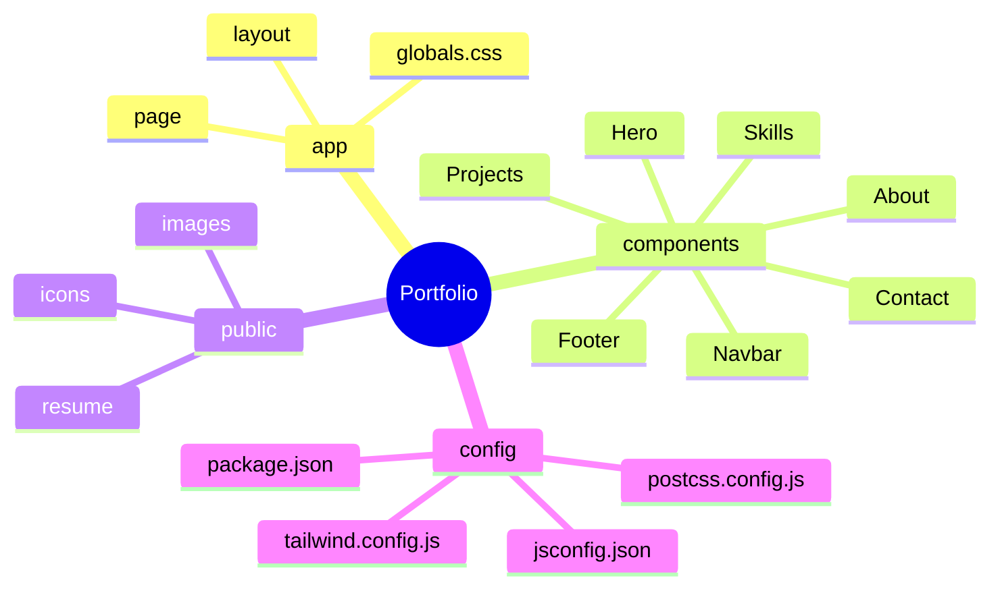

> ℹ️ The `app/`, `components/`, and `public/` contents above are typical examples. Adjust the names to match your actual files.

---

## 🚶 User Journey

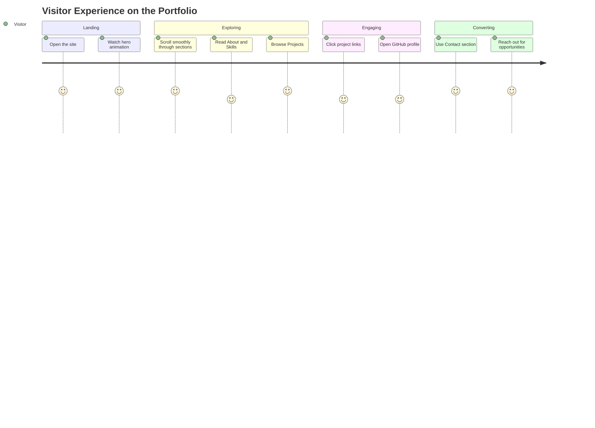

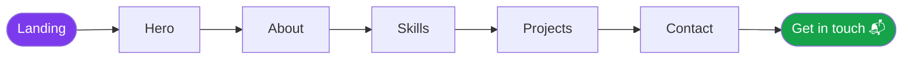

---

## 🎬 Animation Pipeline

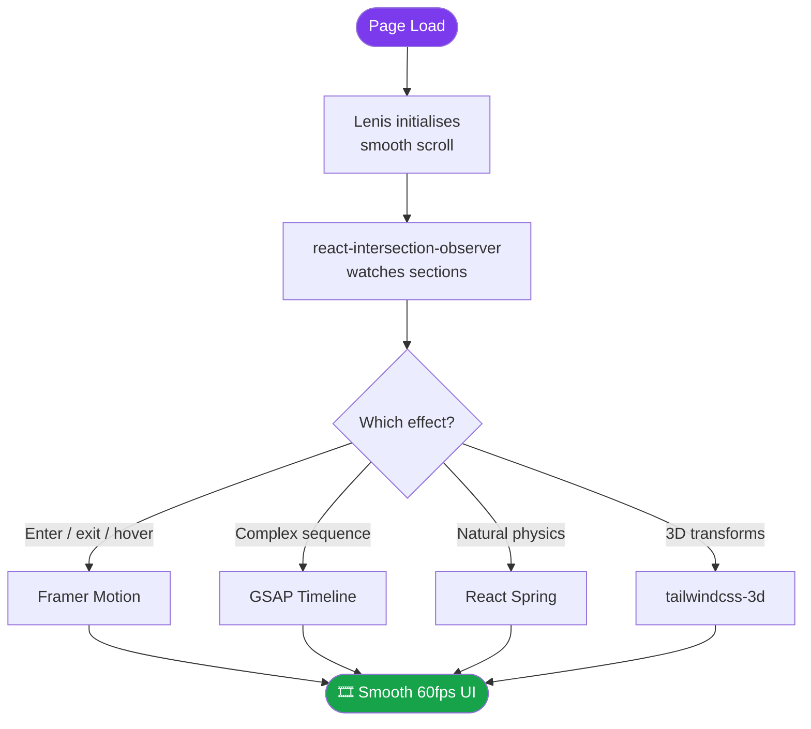

| Library | Best used for | Trigger |
|---------|---------------|---------|
| **Framer Motion** | Page and component transitions, hover and tap | Mount / viewport / gesture |
| **GSAP** | Multi-step timelines, text and scroll effects | Scroll / load |
| **React Spring** | Springy cards, counters, parallax | State change |
| **Lenis** | Inertia scrolling | Wheel / touch |
| **Intersection Observer** | Reveal on scroll | Element visibility |

---

## 📊 Data Charts

> 📌 **Note:** The first chart is based on the real dependencies in `package.json`. The other charts use **illustrative placeholder values**. Replace them with your real numbers (Lighthouse scores, skill levels, etc.).

### 🥧 Dependency Breakdown (from `package.json`)

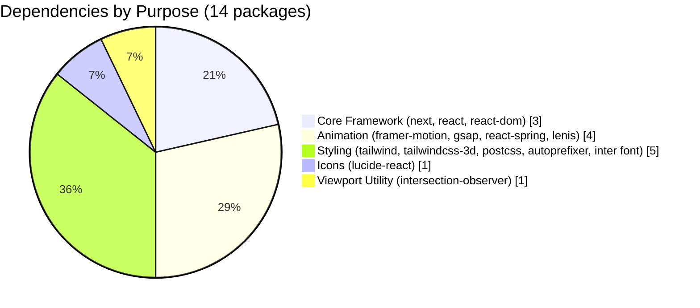

### 📶 Skill Proficiency (illustrative)

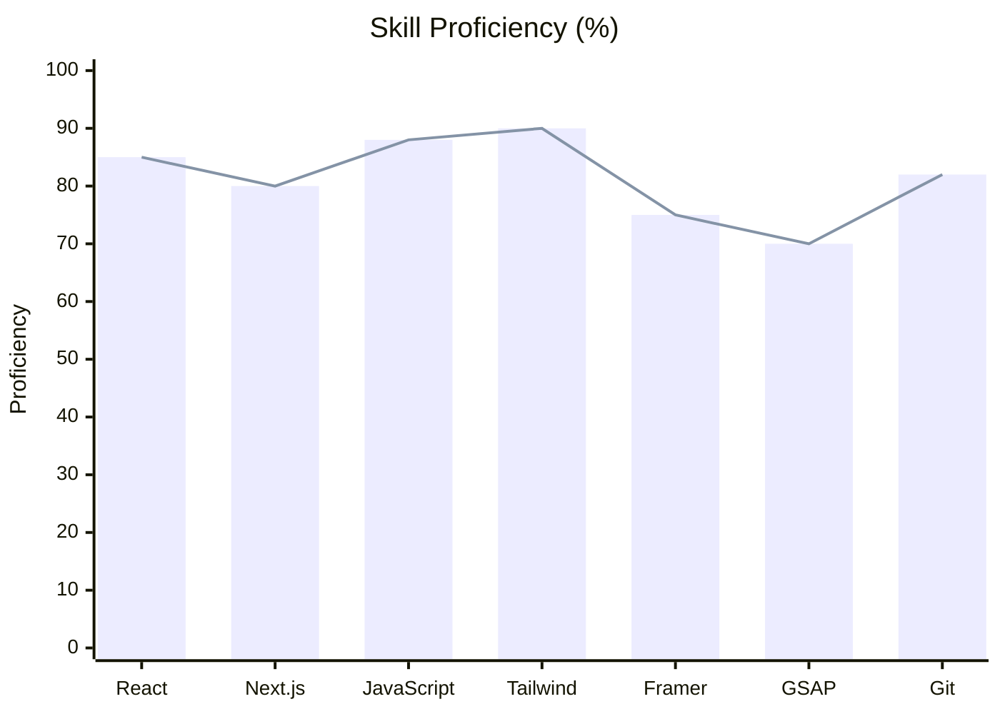

### 🚦 Lighthouse Targets (illustrative)

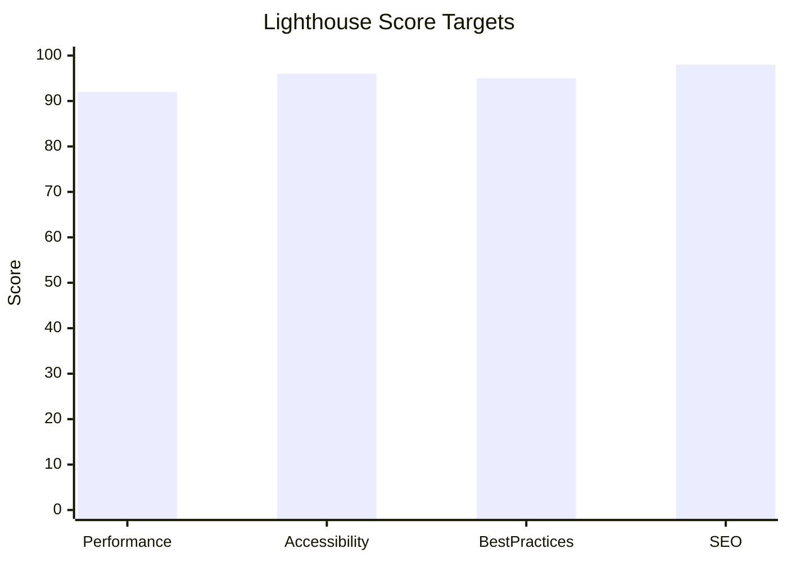

### 📈 Learning & Growth Over Time (illustrative)

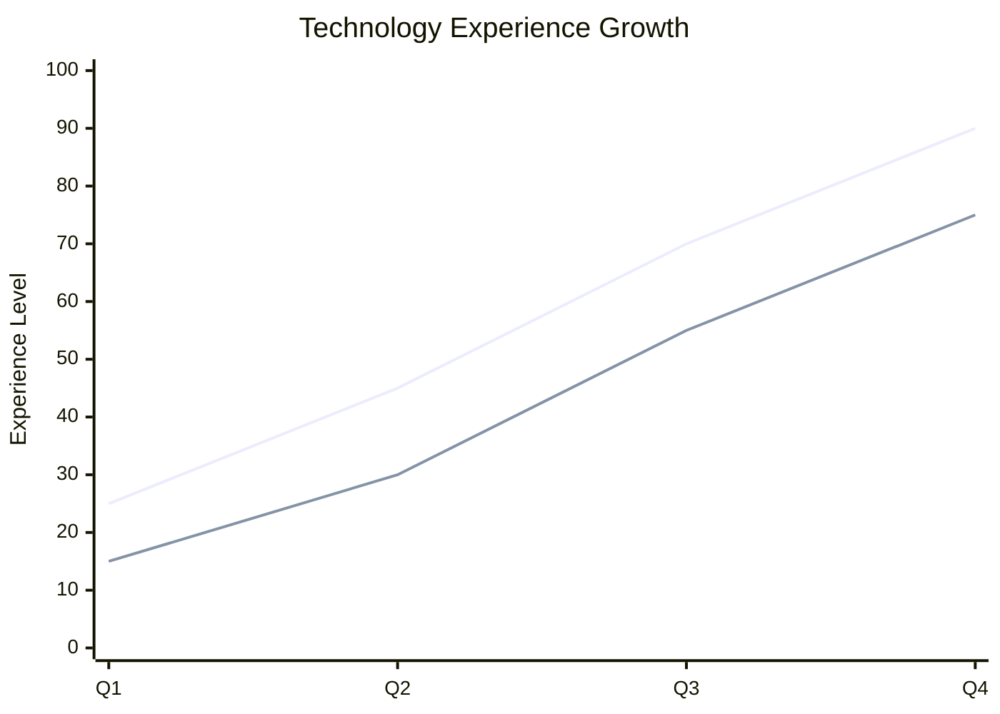

### 🎯 Priority Matrix: Effort vs Impact

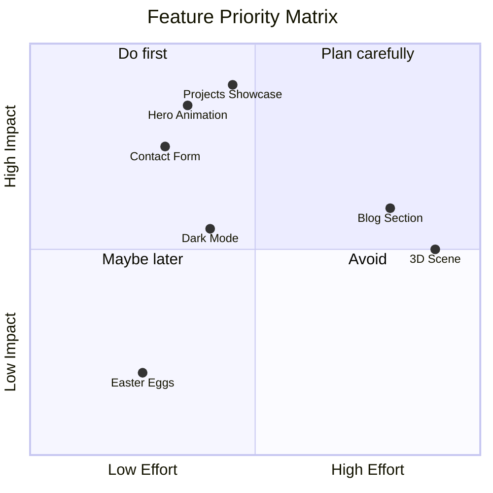

### 🗓 Project Timeline (Gantt)

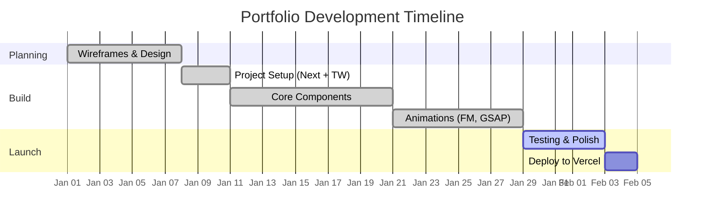

### 🧮 Tech Usage Radar (table view)

| Category | Level | Visual |
|----------|:-----:|--------|
| Frontend Framework | 90% |  |
| Styling / UI | 90% |  |
| Animation | 80% |  |
| Performance | 85% |  |
| Deployment / DevOps | 75% |  |

### 📉 Live GitHub Stats

<div align="center">


<br/>


<br/>


</div>

### 🧬 Database-Style Relationship (Content Model)

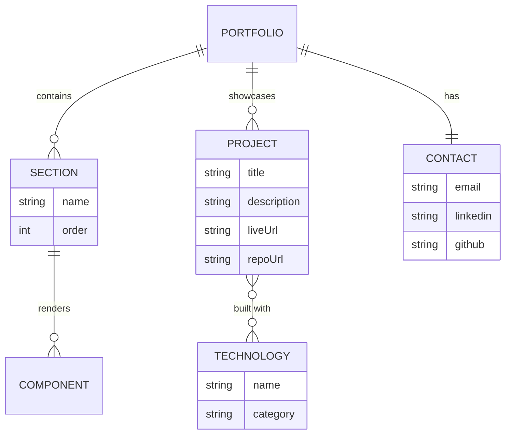

---

## ⚙️ Installation & Setup

### Prerequisites


### Steps

```bash
# 1️⃣ Clone the repository
git clone https://github.com/ashrithBalaji456/Venkatesh_portfolio.git

# 2️⃣ Move into the project
cd Venkatesh_portfolio

# 3️⃣ Install dependencies
npm install

# 4️⃣ Start the dev server
npm run dev
```

Open **http://localhost:3000** in your browser. 🎉

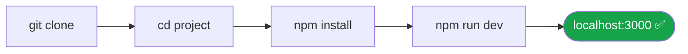

---

## 📜 Available Scripts

| Command | Description |
|---------|-------------|
| `npm run dev` | Start the development server with hot reload |
| `npm run build` | Create an optimised production build |
| `npm run start` | Run the production server (after build) |
| `npm run lint` | Run Next.js ESLint checks |

---

## ☁️ Deployment

This project is deployed on **Vercel**: [venkateshportfolio-chi.vercel.app](https://venkateshportfolio-chi.vercel.app)

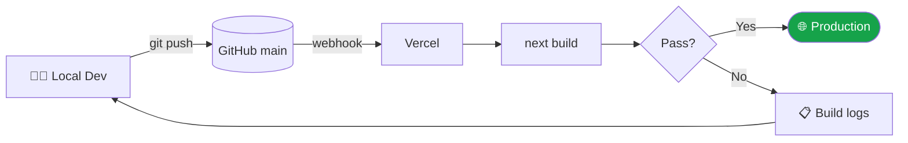

**Deploy your own copy:**

1. Fork this repository
2. Go to [vercel.com/new](https://vercel.com/new) and import your fork
3. Keep the default Next.js settings and click **Deploy**

---

## 🎨 Customization Guide

| What to change | Where |
|----------------|-------|
| Personal info, text, links | Files in `components/` |
| Colours, fonts, themes | `tailwind.config.js` |
| Images, resume, favicon | `public/` |
| Global styles & layout | `app/` |
| Import aliases | `jsconfig.json` |

---

## 🗺 Roadmap

- [x] Next.js 14 + Tailwind setup
- [x] Animated hero and sections
- [x] Smooth scrolling (Lenis)
- [x] Deploy on Vercel
- [ ] Dark / light theme toggle
- [ ] Blog / articles section
- [ ] Contact form integration
- [ ] SEO & Open Graph improvements
- [ ] Accessibility audit (WCAG AA)

---

## 🤝 Contributing

Contributions, issues, and suggestions are welcome!

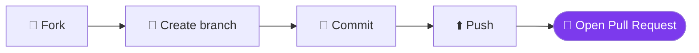

```bash
git checkout -b feature/amazing-feature
git commit -m "feat: add amazing feature"
git push origin feature/amazing-feature
```

---

## 📬 Contact

<div align="center">

[](https://venkateshportfolio-chi.vercel.app)
[](https://github.com/ashrithBalaji456)

<!-- Add your own links below -->
<!-- [](YOUR_LINKEDIN_URL) -->
<!-- [](mailto:YOUR_EMAIL) -->

<br/>


<br/><br/>

⭐ **If you like this project, give it a star!** ⭐

</div>

---

## 📄 License

Distributed under the **MIT License**. Add a `LICENSE` file to the repo if you haven't already.

<div align="center">


</div>
